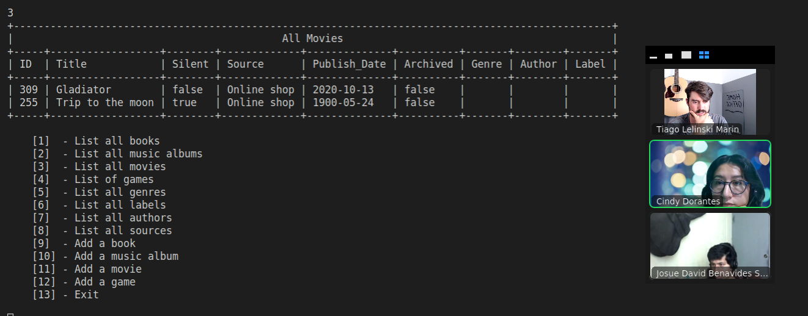

# CATALOG OF MY THINGS
This project is a console app that helps you to keep record of different types of things you own: books, music albums, movies, and games. Everything was based on a given UML class diagram (see below). The data is stored in JSON files but there is also a database prepared with tables structure analogical to the program's class structure.

## Screenshot:
<br>



<br>

## Video presentation
 [Available here](https://drive.google.com/file/d/1b2hxXDXalsIp5HQG9hpA833ANil5JNpz/view?usp=sharing)

<br>

## Built With

<br>

## Getting Started

Clone this repo: https://github.com/tiagomarin/catalog-of-my-things.git

- Go to the repo directory from the comand line.
- Run 
```
bundle install
ruby main.rb
```

### Prerequisites

- Ruby installed in your computer. ([check this guide if you need to install](https://github.com/microverseinc/curriculum-ruby/blob/main/simple-ruby/articles/ruby_installation_instructions.md))
- Any code editor like Vscode or Vim.

## Authors

👤 **Cindy Dorantes**

- GitHub: [@CindyDorantes](https://github.com/CindyDorantes)
- Twitter: [@CindyDorantes10](https://twitter.com/CindyDorantes10)
- LinkedIn: [Cindy Melisa Dorantes Sánchez](https://www.linkedin.com/in/cindydorantessanchez/)

👤 **Tiago Lelinski**

- GitHub: [@tiagomarin](https://github.com/tiagomarin)
- Twitter: [@LelinskiMarin](https://twitter.com/LelinskiMarin)
- LinkedIn: [Tiago](https://www.linkedin.com/in/tiago-lelinski-marin/)

👤 **Josué Benavides**

- GitHub: [@github](https://github.com/jdbs9514)
- Twitter: [@twitter](https://twitter.com/JODA1015)
- LinkedIn: [LinkedIn](https://linkedin.com/in/macoin)

## 🤝 Contributing

Contributions, issues, and feature requests are welcome!

Feel free to check the [issues page](../../issues/).

## Show your support

Give a ⭐️ if you like this project!

## Acknowledgments

- Thanks to my learning partners for their support and advices

## 📝 License

This project is [MIT](./LICENSE) licensed.
